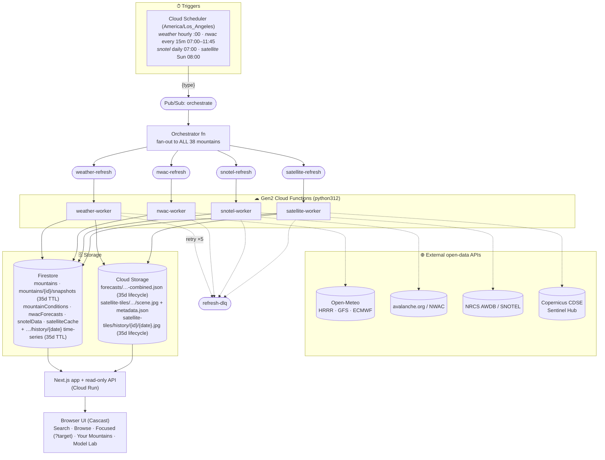

# Cascast

Unified mountain weather for Washington State hiking & mountaineering. The **mountain** is the
only first-class entity: search a peak, browse it, and the app continuously aggregates
**multi-model weather** (Open-Meteo HRRR / GFS / ECMWF), **avalanche danger** (NWAC), **snowpack**
(NRCS SNOTEL), and **satellite snow imagery** (Copernicus Sentinel-2 via CDSE) into a calm,
decision-oriented forecast — with a monospace **Model Lab** drill-down for the details. All 38
mountains are pulled on a fixed schedule regardless of interest, so the data is always there.

**Pins are client-side only** (browser localStorage) — there are no accounts and no server-side
state. Pinning a peak picks a target date and local notes, then opens a focused view; the target
date also lives in the URL (`/mountains/[slug]?target=YYYY-MM-DD`) so a focused view is shareable.

See [**Open data sources**](#open-data-sources) for a per-source data card (what each feed
contains, how often it refreshes, and exactly how) and the [**system diagram**](#system-diagram).

## Architecture

- **Frontend** — Next.js 16 (App Router, React 19, TypeScript, Tailwind), deployed to **Cloud Run**.
  Recreates the user-approved **Cascast** design (`prototype-ui/prototype-design-review/`). Home is a
  **search** box (≥3 chars → suggestions → browse); `/mountains/[slug]` is the browse view (current
  + 7-day + avalanche + snowpack + satellite + Model Lab); pinning adds a target-day highlight,
  forecast evolution, and editable local notes via the `?target=` URL; `/your-mountains` lists local
  pins; Model Lab lives at `/mountains/[slug]/models`. Nav: Search · Your Mountains.
- **Backend** — Python 3.12 **Cloud Functions (Gen2)**: an `orchestrator` (fans each source out to
  ALL 38 mountains) plus `weather` / `nwac` / `snotel` / `satellite` workers, triggered by Cloud
  Scheduler → Pub/Sub. They write **Firestore** (conditions, per-mountain snapshots, forecasts) and
  **Cloud Storage** (combined forecast blobs, satellite scenes + metadata).
- **Data model** — the **mountain** is the only entity. Forecast snapshots live at
  `mountains/{id}/snapshots` with a **35-day Firestore TTL** (`expireAt`); each snapshot stores
  per-model, per-DAY (date-keyed) rows so forecast evolution works for any client-chosen target date.
  No `projects` collection, no server-side pins.
- **Infra** — Terraform (`terraform/`): a **single environment** ((default) Firestore database, bare
  resource names, no workspaces). APIs, IAM, buckets, Pub/Sub, Scheduler, Firestore + TTL, the web
  Cloud Run service, and monitoring all in one `terraform apply`.
- **Source of truth** — `docs/superpowers/specs/2026-06-14-interface-contract.md` (paths, resource
  names, API contracts, schemas, types, seed data). Design system: `prototype-ui/.../DESIGN.md`.

### System diagram

One **Cloud Scheduler → Pub/Sub → Cloud Functions → Firestore/Cloud Storage → API → UI** pipeline.
Every external feed flows through the same shape: a scheduler tick fans out a Pub/Sub message to ALL
38 mountains, a Gen2 worker fetches the source and writes Firestore (+ Cloud Storage for the bulky
weather blobs and satellite scenes), and the Next.js app reads those back for the browser. The app
is a read-only consumer — it has no write path into the pipeline.



Single environment: the `(default)` Firestore database and bare (un-prefixed) resource names for
Scheduler, Pub/Sub, Functions, buckets, and the Cloud Run service. Region `us-west1`.

## Open data sources

Each feed is refreshed by its own Gen2 worker **on a fixed schedule, for all 38 mountains, whether
or not anyone is looking** — so the data is always there to browse. There is no on-demand / pin-driven
fetching: a user pinning a peak changes only their local view, never the pipeline. The app reads the
stored data back through read-only `app/api/**` route handlers. All workers are **idempotent** and
degrade gracefully — a source outage leaves the last good data in place rather than crashing the
pipeline. Canonical units: **°F**, **mph**, **feet**, **inches** (the UI converts on the fly).

#### How a refresh happens (every source, same shape)

`Cloud Scheduler` fires a tick → publishes `{type}` to the **`orchestrate`** Pub/Sub topic → the
**orchestrator** function loads all 38 mountain ids and fans out one `{ "mountainId": <id> }` message
per mountain to that source's `*-refresh` topic → the per-source **worker** fetches the external API
for that mountain, normalizes it, and writes Firestore (+ Cloud Storage for the bulky weather blobs &
satellite scenes). Undeliverable messages retry then land in `refresh-dlq`. The web app only ever
**reads** the result.

#### Pull schedule (Cloud Scheduler, timezone `America/Los_Angeles`)

| Source | Worker | Cron | In plain English | Per run |
|---|---|---|---|---|
| Multi-model weather | `weather-worker` | `0 * * * *` | **Hourly**, on the hour | all 38 mountains; appends a per-mountain snapshot (35-day TTL) |
| Avalanche danger (NWAC) | `nwac-worker` | `*/15 7-11 * * *` | **Every 15 min, 07:00–11:45**, in-season | all zones; worker **skips** once today's forecast is captured (so it effectively grabs the morning publish once); appends a dated history entry (35-day TTL) |
| Snowpack (SNOTEL) | `snotel-worker` | `0 7 * * *` | **Daily at 07:00** | all stations; latest doc holds a 30-day trailing window; appends a dated history entry (35-day TTL) |
| Satellite snow imagery | `satellite-worker` | `0 8 * * 0` | **Weekly, Sundays at 08:00** | all 38 mountains; renders the latest cloud-free Sentinel-2 scene; appends a dated scene + image to history (35-day TTL / GCS lifecycle) |

Weather + NWAC retry once on failure; all four route undeliverable messages to `refresh-dlq` (a
monitored alert fires if it ever has messages). You can force any source for one mountain on demand by
publishing `{ "mountainId": "<id>" }` to its `*-refresh` topic (or `POST /api/admin/trigger-refresh?mountainId=<id>&type=weather|nwac|snotel|satellite`).

Where each feed lands (every source keeps a **latest** record for fast reads *and* appends a dated **history** entry):

| Source | Firestore (latest · history) | Cloud Storage (latest · history) |
|---|---|---|
| Multi-model weather | `mountainConditions/{id}` · `mountains/{id}/snapshots/*` | `forecasts/{id}/{date}/{HHmm}-combined.json` |
| Avalanche danger (NWAC) | `nwacForecasts/{zoneId}` · `nwacForecasts/{zoneId}/history/{date}` | — |
| Snowpack (SNOTEL) | `snotelData/{id}` · `snotelData/{id}/history/{date}` | — |
| Satellite snow imagery | `satelliteCache/{id}` · `satelliteCache/{id}/history/{date}` | `satellite-tiles/{id}/scene.jpg` + `metadata.json` · `history/{id}/{date}.jpg` |

**Retention — a rolling 35-day window.** Each pull is date-keyed (`…/history/{date}`), so re-running the
same day overwrites rather than duplicates, and the window fills up day by day. Everything older than
35 days drops automatically: the weather `snapshots` and every `history` subcollection carry an
`expireAt` field deleted by Firestore TTL (one policy on the `snapshots` collection group, one on the
`history` collection group); the weather `combined.json` blobs and the satellite `history/` scenes
expire via 35-day GCS lifecycle rules. The **latest** docs (and the latest `scene.jpg`) never expire —
they're the always-current read path. Once the window is full you can see how a forecast trended toward
a date, or how snowpack/cloud cover evolved over the last few weeks.

### ❄️ Multi-model weather — Open-Meteo (HRRR · GFS · ECMWF)

- **Contains** — hourly forecast across three models for each peak: 2 m + apparent temperature,
  wind speed / gusts / direction, precipitation (+ probability), snowfall, freezing level, cloud
  cover, visibility, weather code. Plus **per-band summit/mid/base temperatures**, chosen per peak
  by matching pressure-level *geopotential height* (925→400 hPa) to the band's real elevation, so a
  14,000 ft summit isn't read off a mid-mountain level. The worker distils this into a
  decision-oriented `currentSummary` (target-window high/low, wind, precip type, freezing level,
  tone, and a one-line verdict).
- **Source** — `GET https://api.open-meteo.com/v1/forecast`, models `gfs_hrrr`, `gfs_seamless`,
  `ecmwf_ifs025`, requested in imperial units. (Quirks the code handles: freezing level &
  visibility come back in *feet* under imperial; ECMWF carries no freezing-level field; HRRR only
  reaches ~18–48 h.)
- **Updated** — Cloud Scheduler fires `{type:"weather"}` hourly → the **orchestrator** fans
  `weather-refresh` out to all 38 mountains → `weather-worker` fetches all three models, derives the
  bands + summary, and writes.
- **Stored** — current conditions in `mountainConditions/{id}`; the full multi-model series as a
  `combined.json` blob at `gs://…-weather-data/forecasts/{id}/{date}/{HHmm}-combined.json`; and a
  per-mountain forecast snapshot per refresh at `mountains/{id}/snapshots/*` (35-day Firestore TTL
  via `expireAt`). Each snapshot stores per-model, per-DAY (date-keyed) rows so the Model Lab
  forecast-evolution chart works for any client-chosen target date (snapshots accumulate forward —
  has the forecast been trending warmer/wetter as the date approaches?).

### 🏔 Avalanche danger — NWAC (avalanche.org)

- **Contains** — Northwest Avalanche Center forecast for the peak's zone: danger ratings (1–5) for
  upper / middle / lower elevation bands (today + tomorrow), avalanche problems (type, likelihood,
  size, aspect/elevation rose), and the bottom-line / hazard / weather discussions. Off-season it
  records `season: "summer"` and the UI shows an off-season banner.
- **Source** — `GET https://api.avalanche.org/v2/public/product?type=forecast&center_id=NWAC&zone_id={zoneId}`
  (no auth). Zones are mapped per peak via `nwacZoneId` (e.g. West Slopes South = `1648`).
- **Updated** — Scheduler fires `{type:"nwac"}` in the morning during avalanche season (when NWAC
  publishes) → orchestrator publishes `nwac-refresh` per zone → `nwac-worker` fetches and writes,
  **skipping** if today's forecast is already captured.
- **Stored** — latest forecast in `nwacForecasts/{zoneId}`, plus a dated copy appended to
  `nwacForecasts/{zoneId}/history/{forecastDate}` (35-day TTL); the UI joins a mountain to its zone via
  `nwacZoneId`.

### 🌨 Snowpack — NRCS SNOTEL

- **Contains** — automated snow-telemetry for the peak's nearest SNOTEL station: snow water
  equivalent (SWE), snow depth, daily max/min temperature, precipitation accumulation, the median
  SWE and **percent-of-median**, plus a 30-day SWE/depth trend.
- **Source** — `GET https://wcc.sc.egov.usda.gov/awdbRestApi/services/v1/data` for elements
  `WTEQ, SNWD, TMAX, TMIN, PREC` (daily, median central tendency), per `snotelStationId` /
  triplet (e.g. Rainier = Paradise, `679:WA:SNTL`). No auth.
- **Updated** — Scheduler fires `{type:"snotel"}` daily → orchestrator publishes `snotel-refresh`
  per station → `snotel-worker` pulls the trailing 30 days and refreshes the latest doc.
- **Stored** — latest reading in `snotelData/{id}`, plus a dated copy appended to
  `snotelData/{id}/history/{readingDate}` (35-day TTL) so the snowpack series accumulates; the UI
  joins a mountain to its station via `snotelStationId`.

### 🛰 Satellite snow imagery — Copernicus Sentinel-2 (CDSE)

- **Contains** — the most recent *cloud-free* (<70 % cloud) Sentinel-2 L2A scene over the peak,
  rendered as a true-color JPEG, plus its scene metadata (scene id, acquisition date, cloud-cover
  %, bounding box). This is the actual current snowpack imagery — not an annual composite.
- **Source** — Copernicus Data Space Ecosystem (Sentinel Hub APIs, OAuth client-credentials):
  the **Catalog API** (`sh.dataspace.copernicus.eu/catalog/v1/search`) finds the latest qualifying
  scene, then the **Processing API** (`…/api/v1/process`) renders a 512×512 true-color image of the
  peak's bounding box for that date. (Credentials live in Secret Manager; an EOX s2cloudless tile
  template is retained as a no-auth fallback layer.)
- **Updated** — Scheduler fires `{type:"satellite"}` weekly → orchestrator publishes
  `satellite-refresh` for each of the 38 mountains → `satellite-worker` searches, renders, and
  stores the scene (you can refresh any mountain on demand by publishing to the `satellite-refresh`
  topic).
- **Stored** — latest metadata in `satelliteCache/{id}` (mirrored to GCS `satellite-tiles/{id}/metadata.json`)
  and the rendered scene at `gs://…-satellite-tiles/{id}/scene.jpg`, streamed to the UI via
  `GET /api/mountains/[slug]/satellite/image`. Each distinct scene date is also appended to
  `satelliteCache/{id}/history/{sceneDate}` (35-day TTL) and `gs://…-satellite-tiles/history/{id}/{sceneDate}.jpg`
  (35-day GCS lifecycle), banking a visual cloud/snow timeline. Attribution credits Copernicus / Sentinel Hub.

## Local development

Prerequisites: **Node 20.9+** (built with 22), **Python 3.12** (via `uv`), **Firebase CLI**,
**Java** (for emulators), `gcloud` (for deploy), Terraform 1.8+.

```bash
npm install
npm run emulators          # Firestore + Pub/Sub emulators (Firebase)
npm run seed:emulator      # seed 38 mountains into the emulator
npm run dev                # Next.js dev server at http://localhost:3000
```

Python workers:

```bash
cd functions
uv venv --python 3.12 && source .venv/bin/activate
uv pip install -r requirements-dev.txt
pytest                     # unit/contract tests (coverage gate ≥90%, live tests deselected)
```

## Environment variables

Copy `.env.local.example` → `.env.local`. Keys (full reference: interface-contract §2):

| Var | Purpose |
|---|---|
| `GCP_PROJECT` | GCP project id (`mountain-weatherman-app`) |
| `GCS_BUCKET_WEATHER` / `GCS_BUCKET_SATELLITE` | private buckets for forecast blobs / satellite scenes |
| `TOPIC_WEATHER_REFRESH` / `TOPIC_NWAC_REFRESH` / `TOPIC_SNOTEL_REFRESH` / `TOPIC_SATELLITE_REFRESH` | Pub/Sub topic paths used to trigger refreshes (e.g. the admin force-refresh endpoint) |
| `NEXT_PUBLIC_MAPBOX_TOKEN` | optional; map renders a placeholder when unset |
| `NEXT_PUBLIC_EOX_ATTRIBUTION` | EOX s2cloudless attribution string (footer; has a built-in fallback) |
| `FIRESTORE_EMULATOR_HOST` / `PUBSUB_EMULATOR_HOST` | local emulator hosts |

Secrets (e.g. CDSE OAuth for the satellite worker) live in **GCP Secret Manager**, never in env files.

## Tests

- **Web unit** — `npm test` (Vitest) / `npm run test:coverage` (gate **90% lines / 90% functions
  / 85% branches** on `app/api/**`, `lib/**`, `components/**`).
- **Web integration** — `npm run test:integration` (Route Handlers against the Firestore emulator).
- **Python** — `cd functions && pytest` (coverage **≥90%**; `@pytest.mark.live` tests deselected).
- **End-to-end** — `npm run test:e2e` (Playwright, desktop 1280×800 + mobile iPhone 12; also a
  `narrow` 600px project). Specs are route-mocked and cover every flow (search, browse, focused
  `?target` view, Your Mountains, Model Lab) locally. Set `PLAYWRIGHT_BASE_URL=<url>` to reuse the
  same specs against a deployed instance (skips the local web server); otherwise it builds + serves
  locally.

## Deploy

Local-first: develop against emulators. Everything that runs in the cloud — infra, all 5
Cloud Functions, **and** the Next.js frontend on Cloud Run — is provisioned by a single
`terraform apply`. There is **one environment** (the `(default)` Firestore database, bare resource
names, no Terraform workspaces).

```bash
# Deploy everything (builds the web image via Cloud Build, stages + deploys the 5 functions,
# deploys Cloud Run, wires Pub/Sub + scheduler + IAM + monitoring + Firestore TTL, attaches DLQ)
terraform -chdir=terraform apply

terraform -chdir=terraform output -raw web_url     # the live Cloud Run URL
```

Live: `https://mtn-weather-web-hne2exapaa-uw.a.run.app` (service `mtn-weather-web`, us-west1).

Notes:
- **One-time CDSE secret bootstrap**: the satellite worker needs its CDSE secret version before it
  deploys. Create the secret containers via a targeted apply, add the versions
  (`gcloud secrets versions add cdse-client-id|cdse-client-secret`), then run the full
  `terraform apply` — see CLAUDE.md "Cloud resources" for the exact commands. Secret *values* never
  live in Terraform.
- Data seeding stays out of Terraform: `npm run seed:mountains` (the 38 mountains).
- Test the deployed app: `PLAYWRIGHT_BASE_URL=<web_url> npm run test:e2e`.
